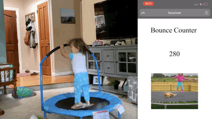

# Trampoline Bounce Counter
This project uses a Raspberry Pi and a ultrasonic distance sensor to count the number of bounces on a trampoline. The data is logged to a file for future stats pages, and the live bounce count is displayed on a simple web page.

## Video:
[[See it in action](https://youtu.be/oUcTvNFyzaw)]



## Setup:
FYI - you have to run **calibrate.py** and **main.py** as sudo for the sensor to work.
```
git clone https://github.com/ericescobar/BounceCounter.git
```
Calibrating will do some math to help find the sweet spot of your bounce. (This will help avoid double bounces, or missed bounces)
```
sudo python calibrate.py
```
If you want to view the web page place **index.html** in your root web directory. Mine is **/var/www/html/index.html** 

I installed php/apache2 on my pi using the following [Link](https://computingforgeeks.com/how-to-install-latest-php-on-debian/)

## Running:
```
sudo python main.py
```

## Extras:
* If you want the script to run on boot, checkout the systemd .service file
* A log is created which details, bounce, date, time, and distance from sensor (in cm)
* The script will check the log file and sum any previous bounces from earlier in the day. Anything not from the current day won't be counted. (duh).

## Credits:
The following sites helped me get the sensor up and running.
* [Wiring](https://thepihut.com/blogs/raspberry-pi-tutorials/hc-sr04-ultrasonic-range-sensor-on-the-raspberry-pi)
* [Sensor Code](https://tutorials-raspberrypi.com/raspberry-pi-ultrasonic-sensor-hc-sr04/)
* [Web Code](https://www.raspberrypi.org/forums/viewtopic.php?t=80957)
